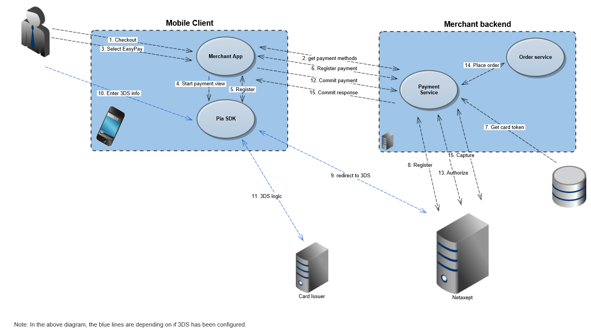
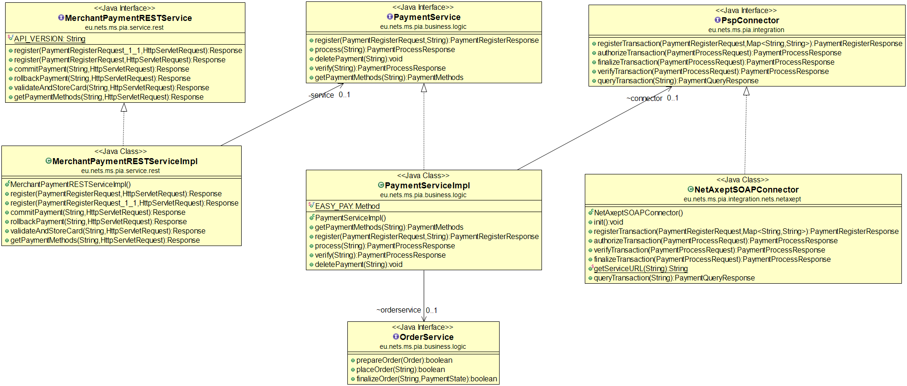

# Netaxept-Sample-Backend


The merchant sample backend is a reference implementation of  a merchant backend and the following main features are to be included:
- APIs for the merchant app to initiate a transaction.
- APIs toward NetAxept to receive transaction status information

**PiA - Netaxept iOS SDK** can also be found [here](https://github.com/Nets-mobile-acceptance/Netaxept-iOS-SDK)

**PiA - Netaxept Android SDK** can also be found [here](https://github.com/Nets-mobile-acceptance/Netaxept-Android-SDK)	


# Get started:


**netaxept-soap-client:**
	This project builds the client used for communicating with Netaxept
	
**pia-merchant-demo:**
	This contains the root pom which builds the netaxept client and the pia-merchant-service.

**etc/secrets:**
	The secrets.properties contains credentials needed to connect to Netaxept.

**src:**
	The sources for the demo merchant backend
	
**target:**
	precompiled ready to run jar file of the merchant demo backend
	
**root:**
	pom.xml	- pom for building the pia-merchant-service
	run.cmd - Sets up necessary environment variables end starts the service


	
# Installation
1) Edit credentials to the file etc/secrets/secrets.properties  
   Enter the test credentials as supplied by Netaxept **(Note: There are Unit tests which verifies the connection to Netaxept, thus these tests require correct credentials.)** or add "-DskipTests" to skip running tests  
   Enter the secret **jwtSecret** for generating the JSON Web Tokens(JWT) via https://jwt.io/  
   Configure the Callback URL in Netaxept admin portal  
   REST Callback API:  
   ```
   Path: /2.0/status/{YOUR_JSON_WEB_TOKEN}  Method: POST
   ```


2) Build "pia-merchant-demo"  
The merchant backend service has a dependency to netaxept-soap-client. For this reason when building for the first time,
build the multimodule project so that the client is installed in the local maven repo.
 
```
mvn clean install -Pdevelopment -f pia-merchant-demo/pom.xml
```

3) Run the service
```
:/> run
```

4) Generate javadoc of "pia-merchant-demo" and docs will be located under 
```
:/pia-merchant-demo>mvn javadoc:javadoc
```

# Payment flow
The payment flow follows the following process:
1) Register payment.
   This will stage a payment order in Netaxept using the parameters provided.
   The parameters define what type of payment is staged and will govern what steps are to follow.
   A unique reference to the staged transaction will be returned to the consumer and is to be used 
   during further processing.
2) Terminal call
   This phase does not involve this component.
   During this phase the Client SDK will provide payment details directly to Netaxept.
   For card payments this is PCI sensitive data like card number, CVV/CVD/CID.
   This data will be appended to the transaction identified by the transactionId returned during phase 1).
   This secret data is never passed through this component. It is transmitted and stored in the PCI certified
   environment at Netaxept.
   When done this data will be available for further processing the payment.
3) Authorization
   A call is made to Netaxept to authorize the transaction using the staged data.
   If the authorization succeeds the Order is placed to the Fake Order service.
   Once the order has been placed successfully the money can be captured in the next stage. 
   After successful authorization also the card token is stored for future use, if that option was selected during phase 1)
4) Finalization
   During this phase the payment is either captured or cancelled.
   The criteria for this is if the goods was successfully processed via the fake order service.
   A cancellation at this stage will free the amount which was reserved to the card account during phase 2.
   After capture, the transaction is complete and cannot be reversed. In that case a refund needs to be 
   invoked which is out of scope for this demo.
   
# Callback 

## Definition and use cases

Occasionally, the information concerning the success of the payment does not reach all parties or remains otherwise unclear. For example, this may be due to an interruption in data communications during the payment or the customer closing the web browser in the middle of the payment process. The most common scenario is that the customer receives confirmation that the payment is successful, but the same information doesn’t reach the merchant. Due to this, the customer never receives the ordered product although the amount is still captured from the customer's account. In order to avoid these scenarios, we recommend you to implement the Callback function as part of the payment process, especially if you have implemented direct bank payments.

The Callback is an alternative to the pull nature of the Query call to verify the status of the transaction. When using Callback, Netaxept will query the respective payment method service provider for an update of the payment status and based on that send automatically information to the Callback URL set by the merchant when the status of the transaction changes to authorised, captured, credited or annulled. Netaxept queries the new status until the timeout value set by the merchant is reached. In addition, Netaxept will also perform one last try 24 hours after the timeout. If the transaction doesn't change its status within the set time frame, Netaxept will consider the transaction as abandoned or completed and stop looking for updates on the transaction in question.

## Implementation of Callback

To be able to use Callback the merchant needs to set the Callback URL and timeout value in Netaxept Admin's Options tab. The Callback URL must start with "https" and we recommend using a signed SSL certificate during the communication. If your Callback URL is protected by a username and password, these need to be added to the Options tab as well. Read more about the Callback settings in  [Netaxept Admin's User Guide >](https://shop.nets.eu/web/partners/user-guides)

The merchant's server must reply to Netaxept's Callback message with "HTTP 200", otherwise Netaxept will retry to send the same Callback message numerous times to the merchant-defined Callback URL. Callback message sent by Netaxept will only include the unique transaction ID for the transaction as a JSON format in the request body. Based on this, you need to send the Query call to Netaxept in order to find out the new status and more detailed information about the transaction.

Example of the Callback URL sent by Netaxept: {"TransactionId":"19a2540f-89c9-43bc-b8c4-870712789b5d"}

If you need to open your firewall for the Callback messages from Netaxept, the following are the applicable outgoing IP addresses:

-   Production
	- If you are using the Netaxept call-back service and have Netaxept IP: 91.102.25.117 whitelisted on your servers or hosting environment, then you need to also whitelist the following Netaxept Azure IPs: 20.73.84.128/28 
	
-   Test
	- If you are using Netaxept callback service and you will have Netaxept IP 91.102.27.1 whitelisted on your servers or hosting environment. Then you need to whitelist these Netaxept Azure IPs instead – 40.127.108.248, 20.31.42.136, 20.67.83.192/30

A reference implementation on how to use the Netaxept callback for a complete E2E transaction is available in this Netaxept sample backend.

# Contact
If you have any question or feedback, please contact us via email: [in-app-support@nets.eu](mailto:in-app-support@nets.eu)

# License

MIT License

Copyright (c) 2020 Nets Denmark A/S

Permission is hereby granted, free of charge, to any person obtaining a copy of this software and associated documentation files (the "Software"), to deal in the Software without restriction, including without limitation the rightsto use, copy, modify, merge, publish, distribute, sublicense, and/or sellcopies of the Software, and to permit persons to whom the Software is furnished to do so, subject to the following conditions:
The above copyright notice and this permission notice shall be included in allcopies or substantial portions of the Software.

THE SOFTWARE IS PROVIDED "AS IS", WITHOUT WARRANTY OF ANY KIND, EXPRESS ORIMPLIED, INCLUDING BUT NOT LIMITED TO THE WARRANTIES OF MERCHANTABILITY,FITNESS FOR A PARTICULAR PURPOSE AND NONINFRINGEMENT. IN NO EVENT SHALL THEAUTHORS OR COPYRIGHT HOLDERS BE LIABLE FOR ANY CLAIM, DAMAGES OR OTHERLIABILITY, WHETHER IN AN ACTION OF CONTRACT, TORT OR OTHERWISE, ARISING FROM,OUT OF OR IN CONNECTION WITH THE SOFTWARE OR THE USE OR OTHER DEALINGS IN THESOFTWARE.
